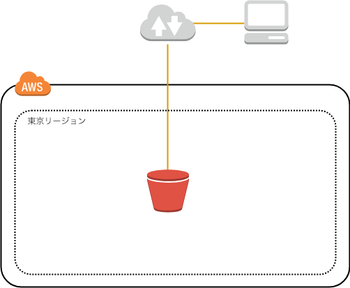

# Amazon S3でWebページを公開してみよう

## 概要

このハンズオンでは、Amazon S3にあるオブジェクトを
インターネットに公開する設定を行います。

Amazon S3にあるオブジェクトは、初期状態ではインターネットへ公開されません。
インターネットに公開する設定を行うことで、
例えばWebページのJavaScript/CSS/画像ファイルなどのアセットをS3に設置して、
配信することができます。

また、Amazon S3の機能の一つである「静的Webホスティング」機能を用いて、
S3だけでWebページを公開する方法も行います。

## 目的

このハンズオンでは、以下のことを行います。

- Amazon S3でバケットを作成する
- バケットにオブジェクトを追加する
- オブジェクトのアクセス権限を管理する
- バケットポリシーを作成する
- 静的ウェブホスティングを設定する

## 全体図



## AWSマネジメントコンソールにアクセスする

1. [AWSのWebサイト](https://aws.amazon.com/jp/)にアクセスし、
    サイト右上にある「コンソールへログイン」をクリックします。
2. ログイン画面です。IAMユーザは「アカウント」には「アカウントID」を入れ、ユーザとパスワードにはIAMユーザのユーザ名とパスワードを入力します。
    ルートアカウントは、ユーザ名にルートアカウントのメールアドレスを入れ、パスワードにはルートアカウントのパスワードを入れます。
    必要事項を入力したら、「サインイン」をクリックします。
    - 多要素認証が有効な場合は、次の画面で認証トークンを入力します。
3. AWSマネジメントコンソールのトップページが開いたら完了です。

## 作業1: Amazon S3バケットを作成する

まずはAmazon S3バケットを作成します。

1. AWSマネジメントコンソールで「サービス」から「S3」をクリックします。
2. 「バケットを作成する」をクリックします。
    「バケット作成」ダイアログボックスが表示されます。
3. 「名前とリージョン」ページで、以下のように設定します。
    - バケット名: jawsug-niigata-20190126-NUMBER
        - NUMBERを適当なランダムな番号に置き換えてください。
    - リージョン: 「アジアパシフィック (東京)」を選択してください
4. 「作成」をクリックします。
    初期設定の状態でバケットを作成する事ができます。
    - "The requested bucket name is not available"で始まるエラーが表示された場合は、すでに同じバケット名が世の中に存在していることを示しています。最初の「Edit」リンクをクリックしてバケット名を変更して再度作成してください。

## 作業2: ファイルをアップロードする

1. 右にあるリンクを右クリックして、画像ファイルをダウンロードします。
    [bicycle.jpg](./obj/bicycle.jpg)
2. S3バケット一覧で、先ほど作成した「jawsug-niigata-*」で始まる
    バケット名をクリックします。
3. 「アップロード」をクリックします。
4. 「アップロード」ダイアログボックスで「ファイルの追加」をクリックします。
5. 先ほどダウンロードした画像ファイルを参照して、選択します。
6. 「アップロード」をクリックします。
    - アップロードの進行状況は、画面下部にある転送状態を示すパネルで確認できます。
        ファイルのサイズが非常に小さいと、転送が表示されない場合があります。
        ファイルがアップロードされると、バケットに表示されます。

## 作業3: ファイルを公開する

先ほどアップロードした画像ファイルをインターネットに公開しましょう。
初期設定では、バケット内のオブジェクトはインターネットに公開されていません。
この作業では、オブジェクトのACLを変更して、インターネットに公開します。

1. S3バケット一覧で、先ほど作成した「jawsug-niigata-*」で始まる
    バケット名をクリックします。
2. 先ほどアップロードした画像ファイルをクリックします。
    - オブジェクトのメタデータが表示されます。
3. オブジェクトURLをクリックします。
    - オブジェクトはインターネットに非公開なので、アクセスが拒否されます。
4. 「公開する」をクリックします。
    - しかし、「エラー アクセス拒否」と表示され、インターネットに公開できません。
    - 初期設定では、パブリックアクセス設定にて、
      インターネットに公開するためのACL設定に変更するための権限が
      無効になっているため、この設定を有効化する必要があります。
5. S3バケット一覧で、先ほど作成した「jawsug-niigata-*」で始まる
    バケット名をクリックします。
6. 「アクセス権限」をクリックします。
7. 「パブリックアクセス設定」を確認します。
    - 「このバケットのパブリックアクセスコントロールリスト (ACL) を管理する」の各項目がTrueになっています。
8. 「編集」をクリックします。
9. 以下の項目のチェックを外します。
    - 新規のパブリック ACL と、パブリックオブジェクトのアップロードをブロックする (推奨)
    - パブリック ACL を通じて付与されたパブリックアクセスを削除する (推奨)
10. 「保存」をクリックします。
    「このバケットのパブリックアクセス設定を編集する」ダイアログ画面が表示されます。
11. テキストフィールドに「確認」と入力します。
12. 「確認」をクリックします。
    - 「パブリックアクセス設定は正常に更新されました」と表示されればOKです。
13. 「概要」をクリックします。
14. 画像ファイルをクリックします。
    - オブジェクトのメタデータが表示されます。
15. 「公開する」をクリックします。
    - 「成功」と表示されればOKです。
16. オブジェクトURLをクリックします。
    - 画像ファイルが表示されれば、インターネットに公開されています。

これで、オブジェクトがインターネットに公開されました。
公開したオブジェクトを非公開にする方法も学びましょう。

1. オブジェクトのメタデータ画面にて「アクセス権限」をクリックします。
2. パブリックアクセスにある「Everyone」の左側にある○をクリックします。
    - Everyoneに対するアクセス権限設定ダイアログが表示されます。
3. 「オブジェクトの読み取り」のチェックを外します。
4. 「保存」をクリックします。
    - Everyoneの「オブジェクトの読み取り」が「はい」から「-」に変わります。
5. 「概要」をクリックします。
6. オブジェクトURLをクリックします。
    - 「AccessDenied」と表示されていればOKです。
    - 画像ファイルが表示される場合は、
        Webブラウザのキャッシュが残っているかもしれません。
        ブラウザの表示を再読み込みします。

ちなみにバケットのACLより、オブジェクトのACLが優先されます。

## 作業4: S3バケット内のオブジェクトを公開する

先ほどは、オブジェクト個別に公開設定を行いました。
複数のオブジェクトを公開する際は、個々のオブジェクトに対して公開設定をするのは大変です。
ここでは、バケットポリシーを使用して
S3バケット内のオブジェクト全てに対して公開設定を行います。
バケットポリシーはJSON形式で記述し、細かい設定が可能になります。
今回はポリシージェネレータを使用して、S3バケットポリシーを作成してみましょう。

1. S3バケット一覧で、先ほど作成した「jawsug-niigata-*」で始まる
    バケット名をクリックします。
2. 「アクセス権限」をクリックします。
3. 「パブリックアクセス設定」を確認します。
    - 先ほど設定した「このバケットのパブリックアクセスコントロールリスト (ACL) を管理する」の各項目がFalseになっています。
    - 「このバケットのパブリックバケットポリシーを管理する」の各項目がTrueになっています。
4. 「編集」をクリックします。
5. 以下の項目のチェックを外します。
    - 新規のパブリックバケットポリシーをブロックする (推奨)
    - バケットにパブリックポリシーがある場合、パブリックアクセスとクロスアカウントアクセスをブロックする (推奨)
    - 先ほど設定した以下の項目はチェックをつけてもつけなくても、どちらでも構いません
        - 新規のパブリック ACL と、パブリックオブジェクトのアップロードをブロックする (推奨)
        - パブリック ACL を通じて付与されたパブリックアクセスを削除する (推奨)
6. 「保存」をクリックします。
    「このバケットのパブリックアクセス設定を編集する」ダイアログ画面が表示されます。
7. テキストフィールドに「確認」と入力します。
8. 「確認」をクリックします。
    - 「パブリックアクセス設定は正常に更新されました」と表示されればOKです。
9. 「バケットポリシー」をクリックします。
    - バケットポリシーエディター画面が表示されます。
10. バケット名のARN (Amazon Resource Name) の文字列をコピーしておきます。
    - ARNは`arn:aws:s3:::<バケット名>`のような文字列です。
    - 文字列をコピーし、メモ帳などのエディタにARNをメモしておきましょう。
11. 「ポリシージェネレーター」をクリックします。
    - AWS Policy Generator画面がブラウザの別タブに表示されます。
    - 今回はポリシージェネレーターを使って、バケットポリシーを作成します。
12. 以下の項目を設定します。
    - Select Type of Policy: S3 Bucket Policy
    - Effect: Allow
    - Principal: *
    - AWS Service: Amazon S3
    - Actions: GetObject
    - Amazon Resource Name (ARN): arn:aws:s3:::<バケット名>/*
        - 先ほどコピーしたARN文字列を貼り付け、末尾に`/*`を追記します。
13. 「Add Statement」をクリックします。
    - バケットポリシーのステートメントが表示されます。
14. 「Generate Policy」をクリックします。
    - Policy JSON Documentダイアログ画面が表示されます。
15. JSON文字列をコピーします。
    - バケットポリシーは、以下のようなJSONファイルになります。
        以下のようなJSON文字列をコピーしましょう。

```json
{
  "Id": "Policy1234567890123",
  "Version": "2012-10-17",
  "Statement": [
    {
      "Sid": "Stmt1234567890123",
      "Action": [
        "s3:GetObject"
      ],
      "Effect": "Allow",
      "Resource": "arn:aws:s3:::jawsug-niigata-20190126-001/*",
      "Principal": "*"
    }
  ]
}
```

16. S3の管理画面のブラウザタブに戻り、ポリシーエディター内にJSON文字列を貼り付けます。
    - 貼り付けが完了したら、Policy Generatorのタブは閉じて構いません。
17. 「保存」をクリックします。
    - 「このバケットにはパブリックアクセス権限があります」と表示されます。
    - このバケットポリシーの設定により、
        対象のバケット配下にある全てのオブジェクトがインターネットに公開されます。
18. 「概要」をクリックします。
19. 画像ファイルをクリックします。
    - オブジェクトのメタデータが表示されます。
20. オブジェクトURLをクリックします。
    - 画像ファイルが表示されれば、インターネットに公開されています。

公開されたバケットのオブジェクトには、以下のようなURLでアクセス可能です。

```txt
https://s3-<リージョン名>.amazonaws.com/<バケット名>/<オブジェクトキー>
```

## 作業5: 静的ウェブサイトホスティングを有効化する

すでに画像ファイルなどのオブジェクトをインターネットに公開しています。
S3の便利な機能の一つに静的ウェブサイトホスティングがあります。
例えば、`index.html`のようなHTMLファイルをインデックスドキュメントにしたり、
リダイレクト設定をしたりすることができます。

1. S3バケット一覧で、先ほど作成した「jawsug-niigata-*」で始まる
    バケット名をクリックします。
2. 「プロパティ」をクリックします。
3. 「Static website hosting」をクリックします。
4. 「このバケットを使用してウェブサイトをホストする」の左側の○をクリックします。
5. 必要な項目を設定します。
    - インデックスドキュメント:
        「index.html」と入力します。
6. 「保存」をクリックします。

これで、静的ウェブサイトホスティングが有効になりました。
index.htmlをアップロードし、エンドポイントにアクセスしてみましょう。

7. 右にあるリンクを右クリックして、htmlファイルをダウンロードします。
    [index.html](./obj/index.html)
8. S3バケット一覧で、先ほど作成した「jawsug-niigata-*」で始まる
    バケット名をクリックします。
9. 「アップロード」をクリックします。
10. 「アップロード」ダイアログボックスで「ファイルの追加」をクリックします。
11. 先ほどダウンロードしたhtmlファイルを参照して、選択します。
12. 「アップロード」をクリックします。
    - index.htmlファイルのアップロードが完了すればOKです。
13. 「プロパティ」をクリックします。
14. 「Static website hosting」をクリックします。
15. エンドポイントのURLをクリックします。
    - index.htmlの内容が表示されればOKです。

エンドポイントのURLは以下のようになっています。

```txt
https://<バケット名>.s3-website-<リージョン名>.amazonaws.com/<オブジェクトキー>
```

## 作業6: S3バケットを削除する

最後に、S3バケットを削除して後片付けをしましょう。

1. S3バケット一覧で、先ほど作成した「jawsug-niigata-*」で始まる
    バケット名の左側のチェックボックスにチェックを入れます。
2. 「削除」をクリックします。
    「バケットを削除する」ダイアログ画面が表示されます。
3. テキストボックスにバケット名を入力します。
4. 「確認」をクリックします。

バケットの削除が完了すると、バケット一覧からバケット名が無くなります。

以上です。
お疲れ様でした。

---

## パブリックアクセス設定についての補足

パブリックアクセスを設定する際には、バケットの公開設定の他、
「このアカウントのパブリックアクセス設定」を確認する必要があります。

- 初期設定では、アカウントのパブリックアクセス設定は全てFalseになっているので、
    バケットの公開設定は問題なくできるはずです。

## バケットポリシーについて補足

バケットポリシーのJSON文字列のキーは、以下のような意味になります。

- Action: s3への操作を指定します。
    "s3:GetObject"と指定すると、オブジェクトへのGET操作についての設定になります。
- Effect: 許可(Allow)もしくは拒否(Deny)を指定します。
- Resource: ステートメントで扱う対象リソースを指定します。
    今回は、先ほど作成したバケットの中にある全てのオブジェクトを指定しています。
- Principal: リソースへのアクセスが許可もしくは拒否されるユーザ(IAMユーザなど)、
    AWSアカウント、AWSサービスなどを設定します。
    "*"と指定することで、誰でもこの設定の対象になります。

## CORSについて補足

CORS (Cross-Origin Resource Sharing) の設定も可能です。
バケット一覧から、設定したいバケットを選択し、
「アクセス権限」→「CORSの設定」をクリックします。
CORS構成エディタが起動しますので、適宜設定します。

- 参考:
    - [Cross-Origin Resource Sharing (CORS) - Amazon Simple Storage Service](https://docs.aws.amazon.com/ja_jp/AmazonS3/latest/dev/cors.html)
    - [CORS(Cross-Origin Resource Sharing)によるクロスドメイン通信の傾向と対策](https://dev.classmethod.jp/cloud/cors-cross-origin-resource-sharing-cross-domain/)

## 参考

- [S3のアクセスコントロールが多すぎて訳が解らないので整理してみる ｜ DevelopersIO](https://dev.classmethod.jp/cloud/aws/s3-acl-wakewakame/)
- [S3で誤ったデータの公開を防ぐパブリックアクセス設定機能が追加されました ｜ DevelopersIO](https://dev.classmethod.jp/cloud/aws/s3-block-public-access/)
